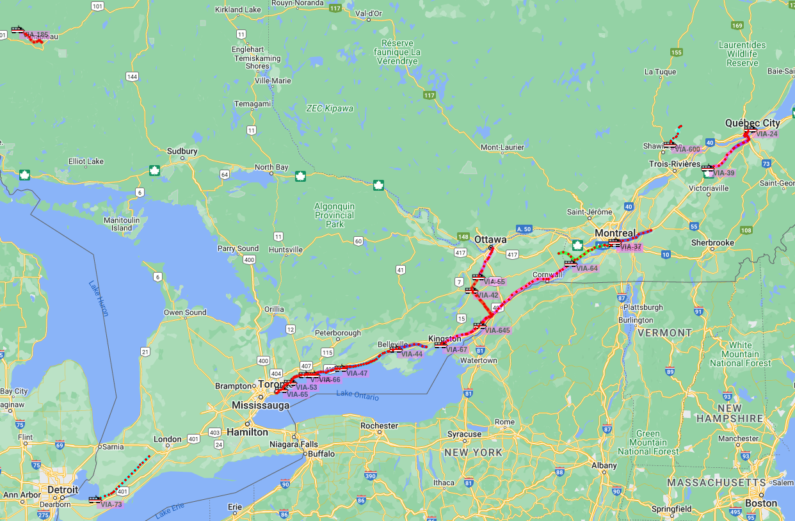

# APRS Trains

This tool aggregates telemetry data about various trains operating in Canada, and publishes their positions to the APRS network.

## Current Sources

- [VIA Rail](https://www.viarail.ca)
- [GO Transit](https://www.gotransit.com)
